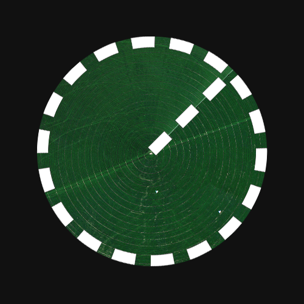
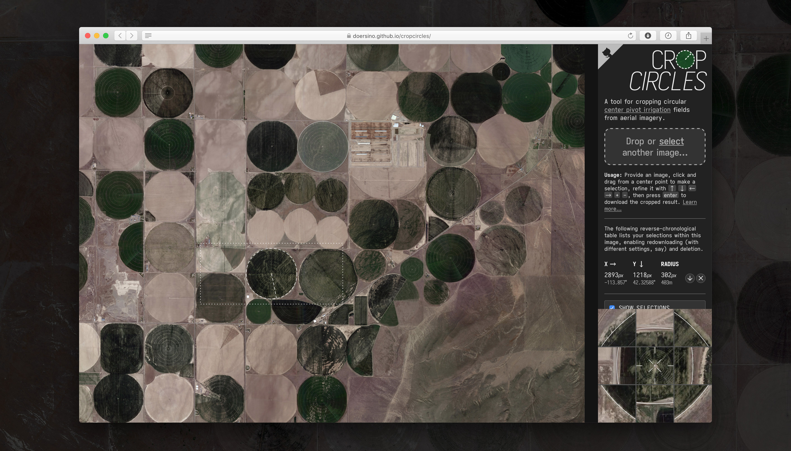
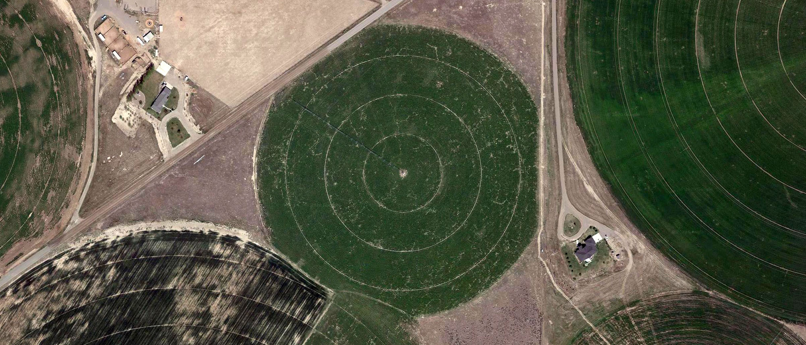
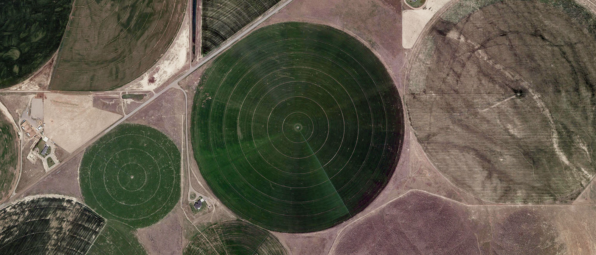
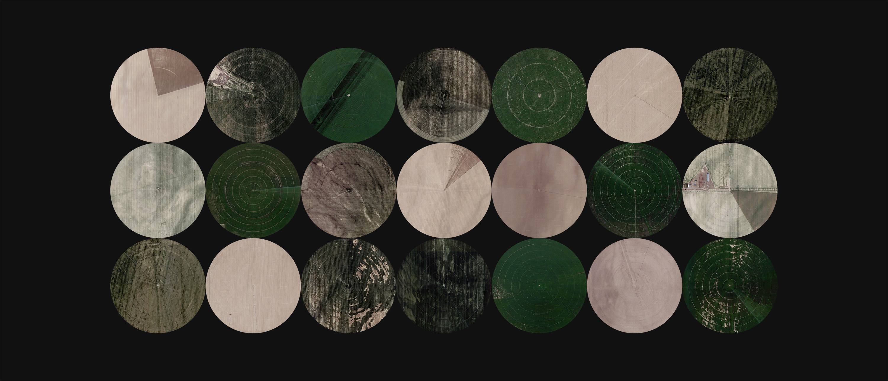
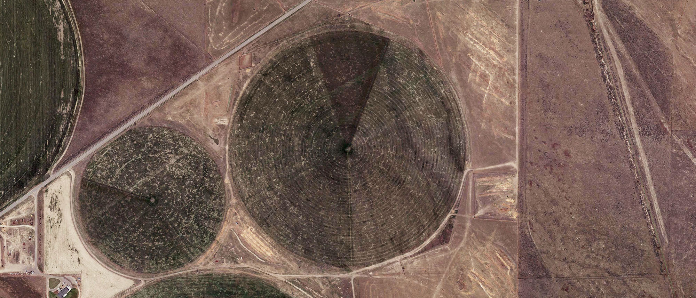

# cropcircles

*Crop Circles* is a purely-client-side [web app](https://doersino.github.io/cropcircles/) originally designed for accurately **cropping circular [center pivot irrigation](https://en.wikipedia.org/wiki/Center_pivot_irrigation) fields from aerial imagery** collected with, for example, [ærialbot](https://github.com/doersino/aerialbot).

But nothing's keeping you from using it to **crop circular objects from imagery-in-a-more-general-sense**!

Among other adjectives, it is...

* *simple* – You can get started right away.
* *yet highly configurable* – Both the tool's behavior and the shape of the end results can be tweaked.
* *fast* – About as fast as an in-browser tool of its kind can reasonably be, anyway.
* *robust* – You can export and restore your settings and selections, which are also kept in [local storage](https://developer.mozilla.org/en-US/docs/Web/API/Window/localStorage).
* *well-documented* – Read the next sentence for more info.

*For more details, **refer to the user's guide** – you can access it through the "Learn more..." link within the web app.*

### Try it out here: https://doersino.github.io/cropcircles/

## Setup & Usage

No setup! It's **a single HTML file with around 2000 lines of JavaScript** code. (Yes, you don't even *really need* the dependencies in `assets/` – text will look uglier, images in the user's guide will be missing, the sample image won't load, and zipping won't work without them, but the core functionality of the tool won't be affected.)

Just **open it in any modern browser** and get to work.

## License & Credits

You may use this repository's contents under the terms of the *MIT License*, see `LICENSE`.

However, the subdirectory `assets/` contains **third-party software with its own licenses**:

* **Iosevka Aile**, the font used throughout the interface, is licensed under the *SIL Open Font License Version 1.1*, see [here](https://github.com/be5invis/Iosevka/blob/master/LICENSE.md).
* **JSZip** is used in accordance with its *MIT License*, see [here](https://github.com/Stuk/jszip/blob/master/LICENSE.markdown).

The **remaining files in `assets/` have been downloaded from Google Maps** with [ærialbot](https://github.com/doersino/aerialbot) (or, in some cases, derived from such downloads). Even though that's techically [freebooting](http://www.hellointernet.fm/podcast/5), I've written about why I think it's no big deal [here](https://github.com/doersino/aerialbot#does-this-violate-googles-terms-of-use). The filenames contain clues as to the locations depicted (except for the favicon, all are from the area shown in the sample image).

Further, the **general layout has been adapted from [Markdeep Diagram Drafting Board](https://github.com/doersino/markdeep-diagram-drafting-board)**, a previous project of mine.

And finally, I've **referenced the source code of Craciun Cezar's [Simple Web Image Editor](https://github.com/craciuncezar/Simple-web-image-editor)** during the implementation of some key features – in fact, the commit history of this project contains some verbatim copies of portions of their code.
