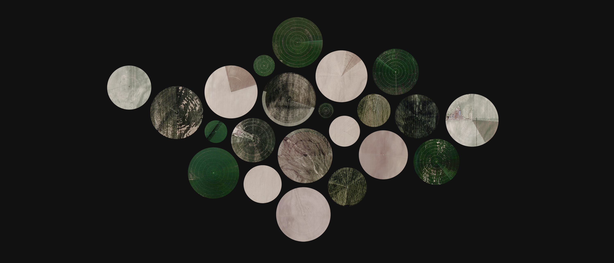

# cropcircles

*A tool for cropping circular center pivot irrigation fields from aerial imagery.*

<em>Crop Circles</em> is a [web app](https://doersino.github.io/cropcircles/) originally designed for **cropping circular [center pivot irrigation](https://en.wikipedia.org/wiki/Center_pivot_irrigation) fields from aerial imagery** collected with [ærialbot](https://github.com/doersino/aerialbot). *But nothing's keeping you from using it to **crop circular objects from imagery-in-a-more-general-sense**!*

#### Try it out here: https://doersino.github.io/cropcircles/

For (many) more details, **refer to the user's guide** – you can access it through the "Learn more..." link within the web app.

## License & Credits

You may use this repository's contents under the terms of the *MIT License*, see `LICENSE`.

However, the subdirectory `assets/` contains **third-party software with its own licenses**:

* **Iosevka Aile**, the font used throughout the interface, is licensed under the *SIL Open Font License Version 1.1*, see [here](https://github.com/be5invis/Iosevka/blob/master/LICENSE.md).
* **JSZip**, is used in accordance with its *MIT License*, see [here](https://github.com/Stuk/jszip/blob/master/LICENSE.markdown).

The **remaining files in `assets/` have been downloaded from Google Maps** with [ærialbot](https://github.com/doersino/aerialbot) (or, in some cases, derived from such downloads). Even though that's techically [freebooting](http://www.hellointernet.fm/podcast/5), I've written about why I think it's no big deal [here](https://github.com/doersino/aerialbot#does-this-violate-googles-terms-of-use).

Further, the **general layout has been adapted from [Markdeep Diagram Drafting Board](https://github.com/doersino/markdeep-diagram-drafting-board)**, a previous project of mine.

And finally, I've **referenced the source code of Craciun Cezar's [Simple Web Image Editor](https://github.com/craciuncezar/Simple-web-image-editor)** during the implementation of some key features – in fact, the commit history of this project contains some verbatim copies of portions of their code.
